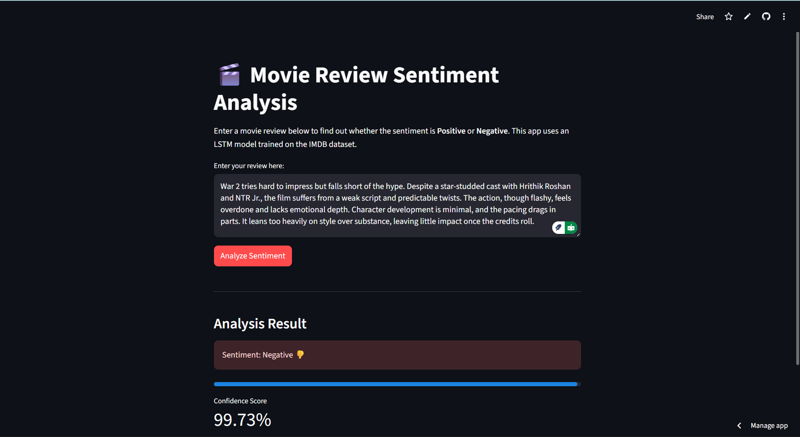

# 🎬 Sentiment-Analyzer-IMDB

[](https://www.python.org/downloads/)
[](https://streamlit.io)
[](https://www.tensorflow.org)
[](https://opensource.org/licenses/MIT)

**Sentiment-Analyzer-IMDB** is a web application that analyzes the sentiment of movie reviews. Using a deep learning model (LSTM) trained on the popular IMDB 50k Movie Reviews dataset, this tool can instantly classify a review as either **Positive** or **Negative**.

The project demonstrates an end-to-end Machine Learning workflow, from data preprocessing and model training with TensorFlow/Keras to building an interactive user interface with Streamlit.

---

### ✨ Live Demo

**[🚀 View the Live App Here](https://sentiment-analyzer-imdb.streamlit.app/)**

### 📸 Screenshot



---

## 🌟 Features

-   **Real-time Sentiment Prediction**: Instantly analyzes any movie review text you provide.
-   **Positive/Negative Classification**: Clearly labels the sentiment of the review.
-   **Confidence Score**: Displays a confidence score to show how certain the model is about its prediction.
-   **Interactive UI**: A simple and clean user interface built with Streamlit.
-   **Pre-trained Model**: Comes with a pre-trained Keras LSTM model, so no training is required to run the app.

---

## 🛠️ Technologies Used

-   **Machine Learning**:
    -   [TensorFlow](https://www.tensorflow.org/) & [Keras](https://keras.io/): For building and training the LSTM neural network.
    -   [Scikit-learn](https://scikit-learn.org/): For data splitting.
    -   [Pandas](https://pandas.pydata.org/): For data manipulation and preprocessing.
    -   [NumPy](https://numpy.org/): For numerical operations.
-   **Web Framework**:
    -   [Streamlit](https://streamlit.io/): For creating and deploying the interactive web application.
-   **Dataset**:
    -   [IMDB Dataset of 50K Movie Reviews](https://www.kaggle.com/datasets/lakshmi25npathi/imdb-dataset-of-50k-movie-reviews)

---

## 📂 Project Structure

```
sentiment_analysis/
│
├── assets/
│   ├── sentiment_lstm.keras    # The pre-trained Keras model
│   └── tokenizer.json          # The Keras tokenizer object
│
├── app.py                      # The Streamlit application script
├── sentiment_analysis_lstm.ipynb # Jupyter Notebook for model training
├── requirements.txt            # Python dependencies
└── README.md                   # You are here!
```

---

## ⚙️ Setup and Installation

To run this project locally, please follow the steps below.

### Prerequisites

-   Python 3.9 or higher
-   `pip` package manager

### 1. Clone the Repository

```bash
git clone https://github.com/Ashish-kharde1/Sentiment-Analyzer-IMDB.git
cd Sentiment-Analyzer-IMDB
```

### 2. Create and Activate a Virtual Environment

It is highly recommended to use a virtual environment to manage project dependencies.

-   **On macOS/Linux:**
    ```bash
    python3 -m venv venv
    source venv/bin/activate
    ```
-   **On Windows:**
    ```bash
    python -m venv venv
    .\venv\Scripts\activate
    ```

### 3. Install Dependencies

Install all the necessary libraries from the `requirements.txt` file.

```bash
pip install -r requirements.txt
```

### 4. Run the Streamlit App

Now you are ready to launch the application!

```bash
streamlit run app.py
```

Your web browser will automatically open to the application's local URL (usually `http://localhost:8501`).

---

## 🧠 Model Details

The sentiment analysis model is a Recurrent Neural Network (RNN) using an LSTM (Long Short-Term Memory) layer.

-   **Model Architecture**: Embedding Layer -> LSTM Layer -> Dense Layer (with Sigmoid activation).
-   **Dataset**: IMDB 50K Movie Reviews (25,000 positive, 25,000 negative).
-   **Vocabulary Size**: Top 5,000 most frequent words.
-   **Embedding Dimension**: 128.
-   **Max Sequence Length**: 200 tokens.
-   **Performance**: The model achieves a test accuracy of approximately **85.25%**.

The training process is detailed in the `sentiment_analysis_lstm.ipynb` notebook. The final trained model (`sentiment_lstm.keras`) and tokenizer (`tokenizer.json`) are saved in the `assets/` directory.

---

## 💡 Future Improvements

-   [x] Deploy the application to Streamlit Community Cloud for public access.
-   [ ] Experiment with more advanced models like GRU or Transformers (e.g., BERT) for potentially higher accuracy.
-   [ ] Add support for neutral sentiment classification.
-   [ ] Implement a feature to analyze sentiment from a URL (e.g., a Rotten Tomatoes review page).

---

## 📜 License

This project is licensed under the MIT License. See the `LICENSE` file for more details.
